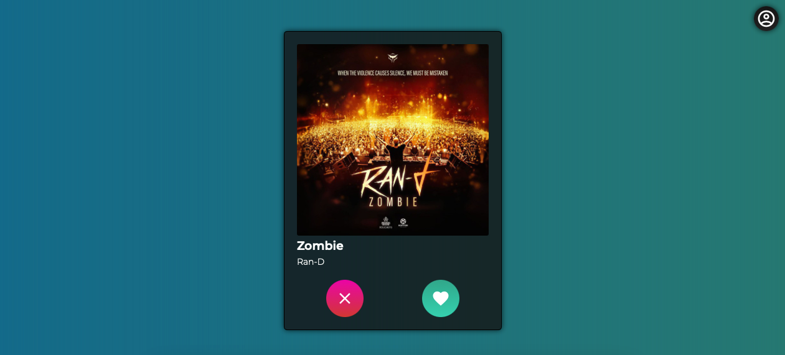
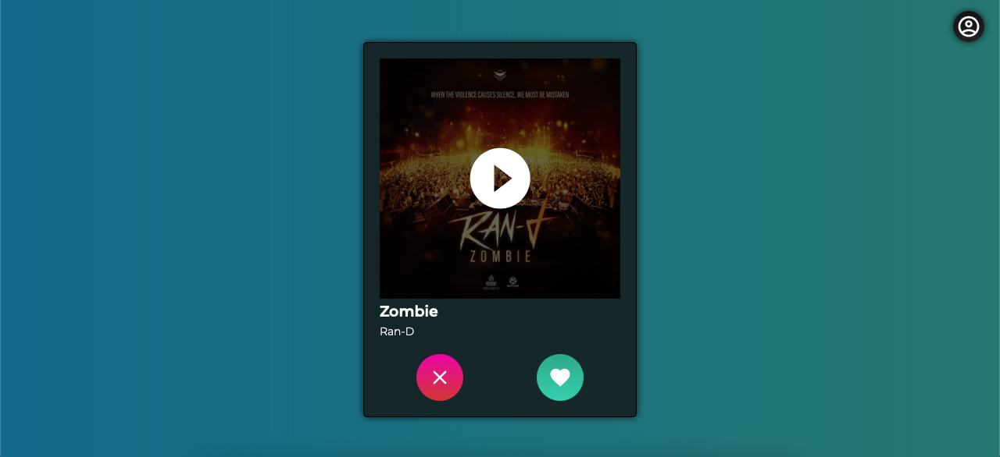
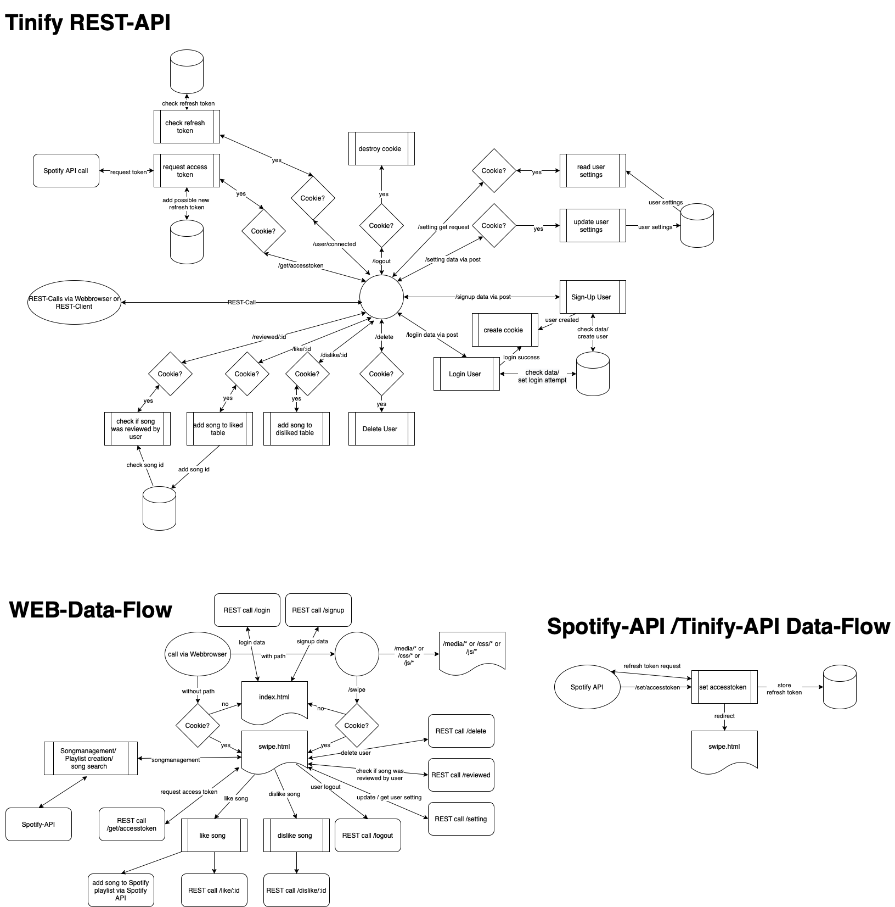
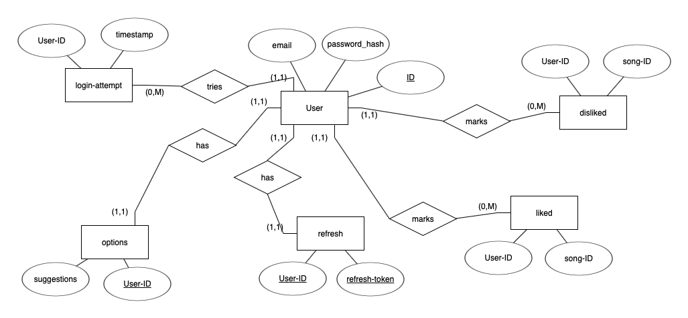

# Tinify (Tinder + Spotify)
Like tinder, but with songs from Spotify

## Description and functions
Tinify is a project of the web engineering course at DHBW. With Tinify you can rate random songs from Spotify and if you like the song it will be added to a Spotify playlist. With this, new songs can be found quickly on Spotify.

**Functions of the webapp**
- dark and light design depending on OS setting
- Account creation for Tinify
- Session management via session-cookies
- account disabled if more than 5 incorrect logins within 5 minutes
- Delete account from Tinify
- store the songs you have already listened to so that they are not repeated
- store the spotify refresh token in the DB
- Spotify playlist creation
- add liked music to playlist
- storage of the Spotify access token in localstorage
- play a 30s preview
- Choice between random song and recommended song

## Set up Spotify Developer access
Spotify tokens are not provided as they are assigned to a developer account and should not be made public.
1.  go to [Spotify Developer Dashboard](https://developer.spotify.com/dashboard/login "Spotify Developer Dashboard")
2. login
3. click the button **"CREATE AN APP"**
4. set a name and a description for the app
5. if you aren't in the app properties, go to your new created app via the dashboard.
6. click the button **"EDIT SETTINGS"**
7. In the section ***"Redirect URIs"*** add your address where Spotify should jump back after a user login.
The address is structured like this: `<PROTOCOL>://<DOMAIN>:<EXTERNALPORT>/set/refreshtoken`
PROTOCOL, DOMAIN, EXTERNALPORT are the ENV vars that are set when the server is started..
8. save the settings
9. in the app view the client-id and the client-secret can be read out
10. Mostly not necessary. Since the generated Spotify app is only in developer-mode, users have to be added manually to use the website. For this, the user must be added under **"USER AND ACCESS"**. The account that created the Spotify app doesn't need to be added.

## How to run
The easiest way to run it is by using the container. If this isn't wanted the following commands must be executed in the root folder of the project.
1. `npm install`
1. `ClIENTID=<clientid> CLIENTSECRET=<clientsecret> node webserver.js`
#### Env vars that should be set
Whether container or running directly via nodejs the following env variables should be set.
- `SESSIONSECRET` : is used to create the session cookies *(default: a long string)*
- `PORT` : is the internal port of nodejs in the container *(default: 3000)*
- `CLIENTID` : is the client ID from the Spotify developer website *(required)*
- `CLIENTSECRET` : is the client secret from the Spotify developer website *(required)*
- `PROTOCOL` : is the protocol used for the web server *(default: http)*
- `DOMAIN` : is the webserver domain *(default: localhost)*
- `EXTERNALPORT` : is the external exposed port of the container *(default: PORT of the ENV-Var)*

## Screenshots
|  |   |
| ------------ | ------------ |
|  |  |
|  |  |
|  |  |
|  |  |
|  |  |
|  |  |
|  |  |

## How to use the docker container
The Docker image will create a volume in addition to the container to persistently store the db.

- **Create image**: run `docker build . -t <image-tagname>` in the root folder of this repo
- **Create container**: run `docker run -p <external-port>:<internal-port> -e CLIENTID=<client-id> -e CLIENTSECRET=<client-secret> -d <image-tagname>` and add all necessary env-vars as `-e` option
- **list all running containers**: run `docker container ls`
- **stop container**: run `docker stop <container-id>`
- **Delete container**: run `docker rm <container-id>`
- **Delete image**: run `docker rmi <image-tagname>`
- **Delete volume**: run `docker volume prune` if the volume name isn't known. However, all unused volumes are deleted. If the volume name is known, the single volume can be deleted with `docker volume rm <volume-name>`.

## Data flow diagram

## Entity-Relationship-Modell

## Elements integrated
- own CSS
- Spotify login and music suggestions
- Login via REST-API on nodejs with sqlite
- Webapp executable in Docker containers

## experience gained
- **went well**: html, css, usage of the express module of nodejs, usage of the api from spotify
- **Problems**: many successive requests to the Spotify API and/or the own API
- **Lessons learned**: working with nodejs and with promises, working with the spotify api